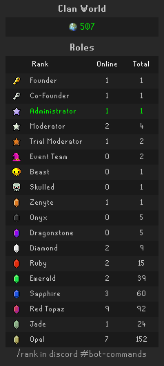
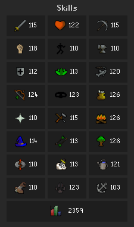
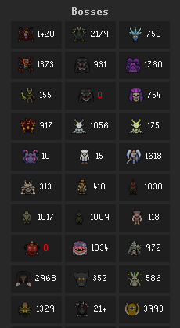
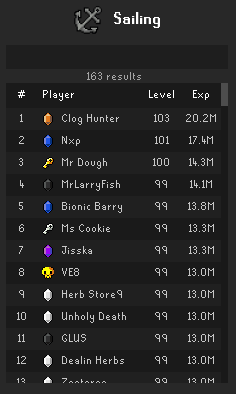
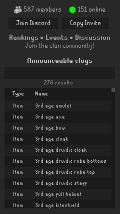
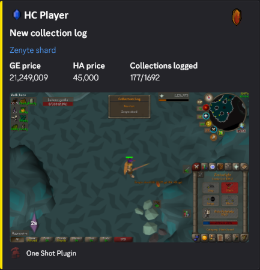

# One Shot

---

## About

**One Shot** is a RuneLite plugin built exclusively for the **One Shot** clan.

- **Hardcore Ironman only**
- **HCGIMs are not permitted**
- Integrates directly with the **One Shot Discord**

> ⚠️ **Important**  
> This plugin will share screenshots to the One Shot Discord **unless disabled in settings**.

---

## Info

- View the clan’s **main world**
- View **clan roles in real time**

  

---

## Clan Rankings

- Compare performance and rankings among top clan members.

  
  
  

---

## Discord Integration

- View live Discord members
- Quickly join the Discord server
- Check which clogs are announceable
- Fully customizable announcement settings

  
  

---

## Settings

  
<b>Discord Global</b>

- **Show notification in chat** - *(default: yes)*

  
<b>Discord Level 99</b>

- **Enable level announcements** - *(default: yes)*
- **Include screenshot** - *(default: yes)*
- **Chat privacy** - *(default: Hide all)*

  
<b>Discord Maxed Level</b>

- **Enable maxed announcements** - *(default: yes)*
- **Include screenshot** - *(default: yes)*
- **Chat privacy** - *(default: Hide all)*

  
<b>Discord 200M XP</b>

- **Enable 200M XP announcements** - *(default: yes)*
- **Include screenshot** - *(default: yes)*
- **Chat privacy** - *(default: Hide all)*

  
<b>Discord Grandmaster Quests</b>

- **Enable GM Quest announcements** - *(default: yes)*
- **Include screenshot** - *(default: yes)*
- **Chat privacy** - *(default: Hide all)*
- **Include total quest points** - *(default: yes)*

  
<b>Discord Elite Diaries</b>

- **Enable Elite Diary announcements** - *(default: yes)*
- **Include screenshot** - *(default: yes)*
- **Chat privacy** - *(default: Hide all)*

  
<b>Discord Combat Achievements</b>

- **Enable CA rewards announcements** - *(default: yes)*
- **Include screenshot** - *(default: yes)*
- **Chat privacy** - *(default: Hide all)*

  
<b>Discord Collection Logs</b>

- **Enable clog announcements** - *(default: yes)*
- **Include screenshot** - *(default: yes)*
- **Chat privacy** - *(default: Hide all)*
- **Include total clogs** - *(default: yes)*

  
<b>Discord Pets</b>

- **Enable pet announcements** - *(default: yes)*
- **Include screenshot** - *(default: yes)*
- **Chat privacy** - *(default: Hide all)*

  
<b>Discord Death</b>

- **Enable death announcements** - *(default: yes)*
- **Include screenshot** - *(default: yes)*
- **Chat privacy** - *(default: Hide all)*
- **Include combat and total level** - *(default: yes)*

  
<b>Leaderboards</b>

- **Display Virtual Levels** - *(default: yes)*

